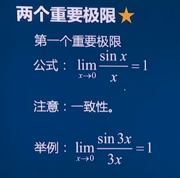
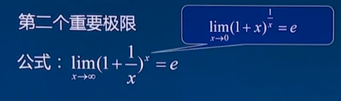
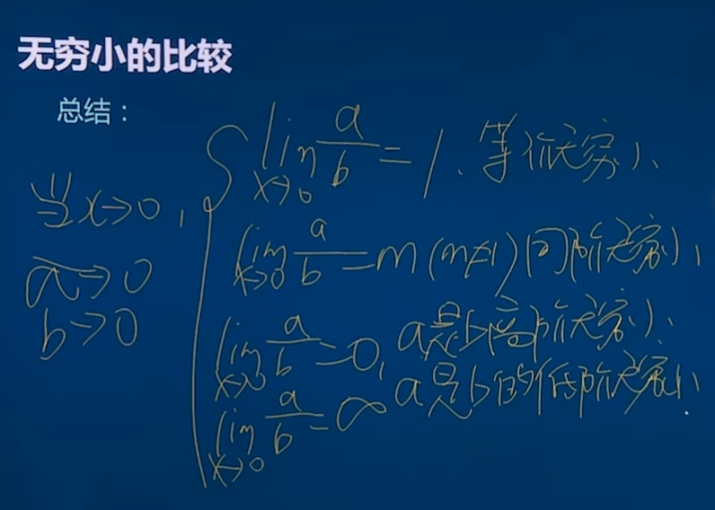
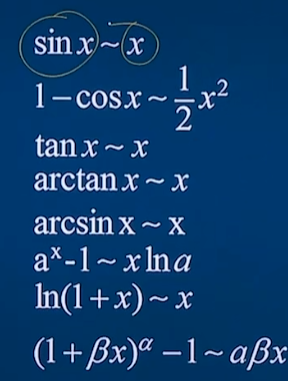

# 第一节极限

极限：对于函数f(x) 接近于但是不等与 ，当X→a时函数的值，接近于常数A，则称为A为X→a的极限。通常等于处理。

$\lim\limits_{x\rightarrow\infty}\frac{1}{x}=0$

* 直接计算法
  - 当X=a时有解时直接带入计算即可，即是此处极限
* 公式法，当带入时无解时可以将函数化简为有理，或下面的情况
  -$\lim\limits_{x\rightarrow\infty}\frac{1}{x}*n={0}$（n为不包含X的数）

### 牢记

-$\sin0=0$
-$\cos0=1$
-$e^0=1$
-$\ln{e}=1$
-$\ln{1}=e$
-$\tan{X}=\frac{sinX}{cosX}$

### 无穷小

### **等价** 无穷小乘除可以替换（加减不行）

#### 速记一些等价无穷小

