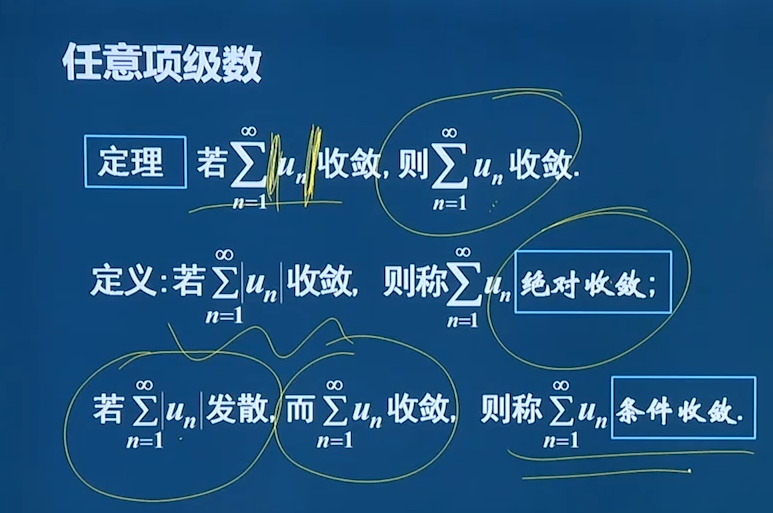
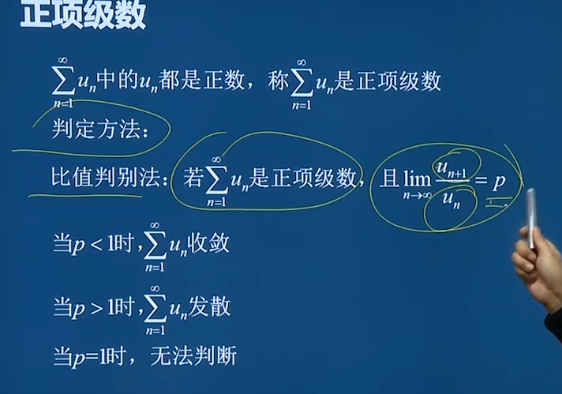
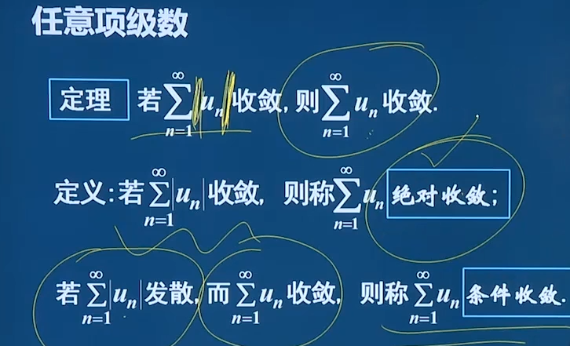
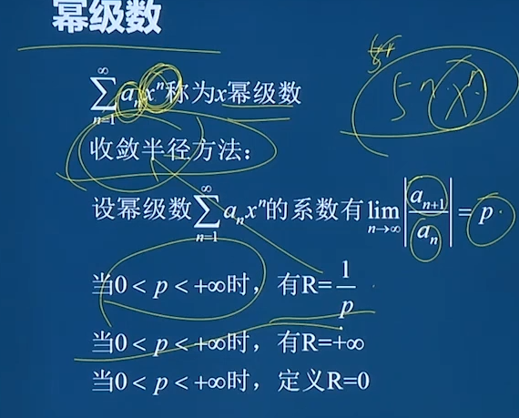

# 无穷级数

一般是正证明是 **等比** 或者 **等差**数列；

#### **等差**数列

其中，$S_n$是前$n$项和，$a_1$是首项，$d$是公差，$n$是项数。

$S_n = \frac{n}{2} \left(2a_1 + (n-1)d\right)$

#### 等比数列

##### 当$q \neq 1$时

其中，$S_n$是前$n$项和，$a_1$是首项，$q$是公比，$n$是项数。

$S_n = \frac{a_1(1 - q^n)}{1 - q}$

##### 当$q = 1$时

$S_n = na_1$

### 一个通向式子收敛时

比有 

$\lim\limits_{x\rightarrow\infty}Un=0$

