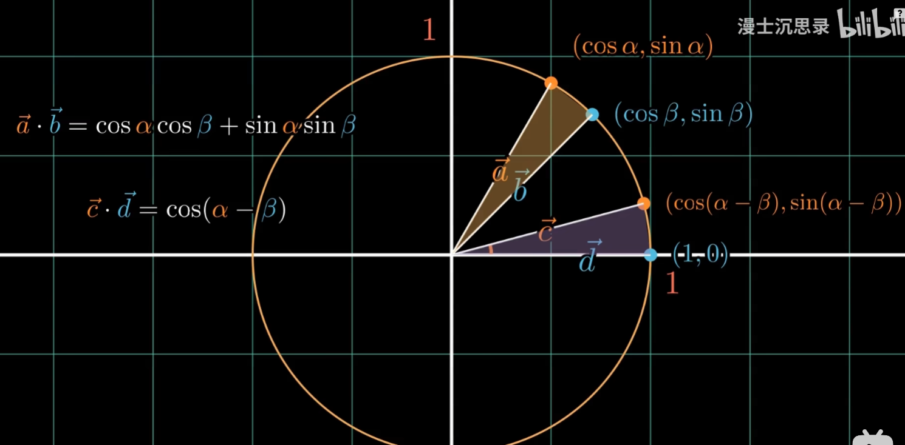
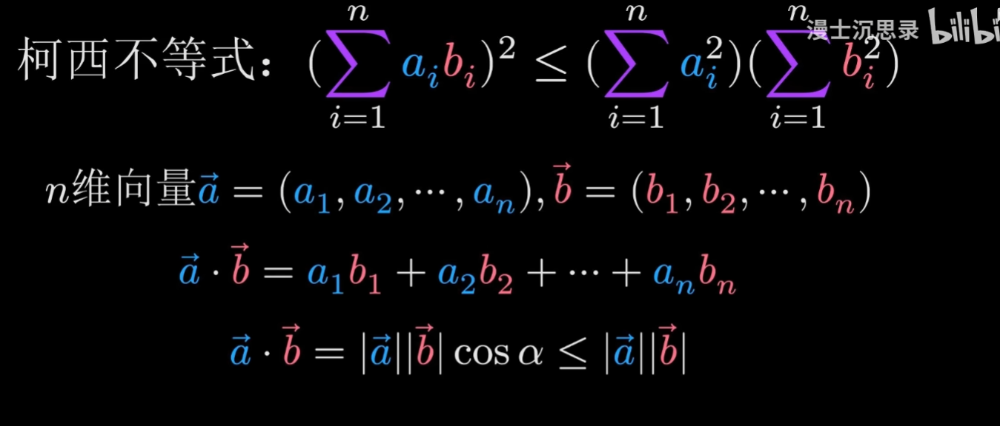
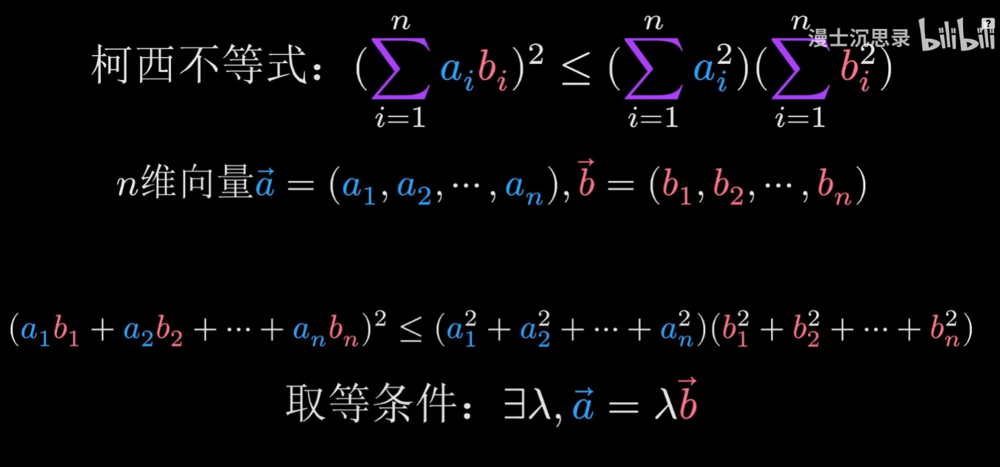
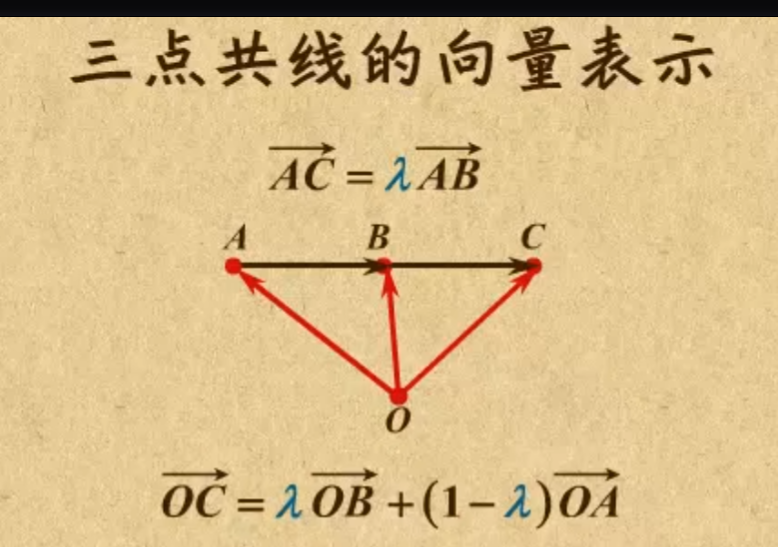

# 高等数学之向量代数与空间解析几何

## 一、数量积(计算结果为数 是人为定义的) **点积** 内积 （用于物理中的做功计算等）

### **1.基本表述**

**$a \cdot b = | a | | b | cos \theta$**

### **2.性质**

(1)$a \cdot a = \left| a \right|^2$

(2)$a\bot b\Leftrightarrow a \cdot b = 0$

### **3.基本运算规律**

(1) 交换律$a\cdot b = b \cdot a$

(2) 分配律$(a + b)\cdot c = a \cdot c + b \cdot c$

(3) 结合律$(\lambda a) \cdot b = \lambda (a\cdot b) \ \ (\lambda为数)$

### **4.坐标表示**

定义$a = a_xi + a_yj + a_zk \ \ \ \ \ b = b_xi + b_yj + b_zk$, 则

**$a\cdot b = a_xb_x + a_yb_y + a_zb_z$**

$a \cdot b=\left| a \right|\left| b \right| cos\theta$

$cos\theta = \frac{a_xb_x+ a_yb_y+a_zb_z} {\sqrt{a_x^2+a_y^2+a_z^2}\sqrt{b_x^2+b_y^2+b_z^2}}$

### **5.几何意义**

* **核心意义**：内积是向量方向相似性的量化，结合模长和夹角反映几何关系。
* **用场景**：从几何角度计算、物理做功到机器学习中的相似性分析，内积均为核心工具。

- 内积的几何意义是 投影与方向相似性的标量度量，公式为 **a**⋅**b**=**∣**a**∣∣**b**∣**cos**θ**

  
折叠文本

	内积可以推到出：
  	 三角形余弦差角公式 和合角公式 （sin是奇函数 sin(-b) = -sin b，cos是偶函数 cos(-b) = cos b）
	 
	 柯西不等式
	 
	 

## 二、向量积(计算结果为向量) 外积、叉积、 **矢量积**

### **1.基本表述**

**$c = a\times b$		其中	$\left| c\right| = \left| a \right|\left| b \right| sin\theta$**

### **2.方向确定: 右手规则**

例如$a\times b = c$，四指并拢先指向a向量的方向，然后将四指朝b向量方向弯曲，此时拇指所指方向即为c向量的方向

### **3.性质**

(1)$a \times a = 0$

(2)$a // b \Leftrightarrow a\times b = 0$

### **4.基本运算规律**

(1)$a\times b =- b \times a$

(2) 分配律$(a + b)\times c = a \times c + b \times c$

(3) 结合律$(\lambda a) \times b = a \times(\lambda b) = \lambda (a\times b) \ \ (\lambda为数)$

### **5.坐标表示**

(用行列式对角计算法)

定义$a = a_xi + a_yj + a_zk \ \ \ \ \ b = b_xi + b_yj + b_zk$, 则

$a\times b = (a_yb_z - a_zb_y)i+(a_zb_x - a_xb_z)j+(a_xb_y - a_yb_x)k$

### **4.几何意义**

-  在三维和二维（伪叉积）中叉积的模长  其$\left| c\right|$为面积 向量a与b围成的平行四边形的面积

- 高维空间无传统叉积，但有向面积可通过外积（楔积）推广为二重向量

## 三、混合积(计算结果为数)

### **1.基本表述**

**$\left[ abc \right] = (a \times b) \cdot c$**

### **2.坐标表示**

定义：

**$\ a = a_xi + a_yj + a_zk \\ b = b_xi + b_yj + b_zk \\ c = c_xi + c_yj + c_zk$**

则：

### **3.性质**

(1)$(a\times b)\cdot c = a\cdot(b\times c) = b \cdot (c\times a)$顺序置换向量计算结果不变

(2) 任意对换两个向量的位置，计算结果加负号

**$(a\times b)\cdot c = -(b\times a)\cdot c \\ (a\times b)\cdot c = -(c\times b)\cdot a \\ (a\times b)\cdot c = -(a\times c)\cdot b$**

(3) **a、b、c三向量共面$\Leftrightarrow [abc] = 0$**

### **4.几何意义**

二维向量交叉

向量的混合积$\left[ abc \right] = (a \times b) \cdot c$的绝对值在数值上等于以向量a、b、c为棱的**平行六面体的体积**

## tips：

### 两个向量平行 AB=入BC

### 行列式：对角线法则计算得出的值

* **二阶行列式**（2×2矩阵的行列式）：表示的是二维平面上由两向量张成的**平行四边形的面积**。
* **三阶行列式**（3×3矩阵的行列式）：表示的是三维空间中由三个向量张成的**平行六面体的体积**。

### 单竖线“| |”通常表示标量的绝对值（如 |−5| = 5）。

### **### 双竖线“||　||”** 专用于向量的模长。
