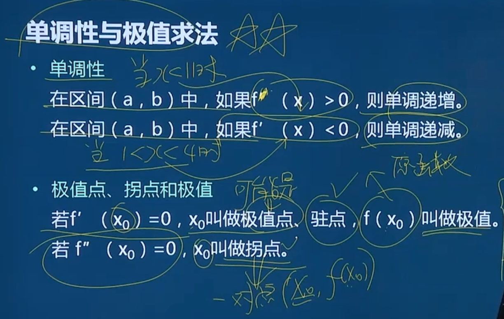

### 是否有定义的判断

#### 定义域

函数的定义域是函数能够取值的所有*x*的集合。如果函数在某个*x*值上没有定义，那么它就不能在该点给出一个明确的函数值。

1. **查看函数表达式**：首先，查看函数表达式是否在该点有明确的数学意义。

   1. 对于函数f(x)=1/x，在*x*=0处没有定义，因为分母不能为零。
   2. 对于$\sqrt{x}$**X需要大于等于0**, 应为小于0时，y为虚数
   3. 对于$\log_a{x}$**X需要大于0**，因为X小0时,y为虚数，等于0时y=负无限（注意此类函数a>0，且a不等于1，等于1时x只能为1无意义）
2. **考虑定义域的限制**：有些函数在其定义域内可能由于某些条件而排除了某些点。例如，对于函数*f*(*x*)=*x*，其定义域是非负实数，因此在任何负实数或复数上都没有定义。
3. **分段函数**：对于分段函数，需要查看该点属于哪个分段，并检查该分段在该点是否有定义。
4. **特殊函数**：有些特殊函数（如狄利克雷函数）在定义上可能包含一些不直观的规则，需要特别注意。

### 函数中是否有极限

这里，我们假设有一个函数*f*(*x*)，并希望判断它在*x*=*a*处是否有极限。

### 极限存在的条件

1. **（左端接近）左极限存在**：当*x*从*a*的左侧趋近于*a*时（即*x*→*a*−），如果*f*(*x*)趋近于某个数*L*，则称*L*为*f*(*x*)在*x*=*a*处的左极限。
2. **（右端接近）右极限存在**：当*x*从*a*的右侧趋近于*a*时（即*x*→*a*+），如果*f*(*x*)也趋近于*L*，则称*L*同样为*f*(*x*)在*x*=*a*处的右极限。
3. **左右极限相等**：如果左极限和右极限都存在且相等，则称函数*f*(*x*)在*x*=*a*处存在极限，且该极限值为左右极限的共同值。
4. **在分段函数中**：函数在接近该点，函数中左右极限存在且相等时才存在极限（从两侧接近）。

### 分段函数是否连续

1. 在分段函数的X=A处是否连续
   要求**左右极限**相等且等于**f(X)**

### 极大值极小值求法 

1. 求导法 ： f'(X)=0 求出驻点后
   1. 可以列表方式写出最大值最小值 **(推荐)**
   2. 对f'(x) 求导  f"(X) 将驻点的x值代入求f"(驻点X值)>0 还 是f"(驻点X值)<0  **(小于0是极大值) (大于0是极小值)**
2. 画图法（如果求f"比较困难） 建议使用

### 间断点

1. 定义域间断的点 ， 如在某些情况下分母不能为0 根号下不能小于0
2. 分段函数也要看分段处是否连续

### 渐近线

当x-> + ∞ 或 x-> -∞时  y->C是水平渐近线是Y=C

当 y-> +∞ 或 y ->-∞时 x->C 是垂直（铅直）渐近线是X=C
