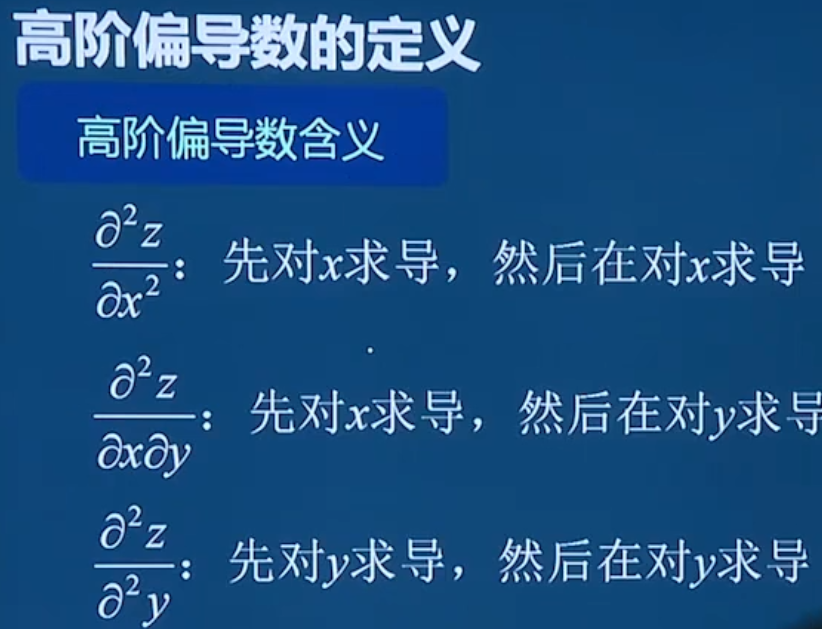
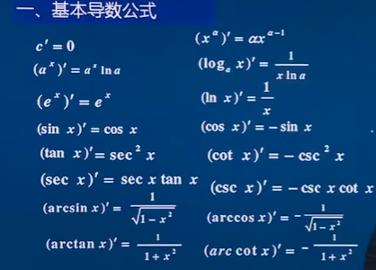
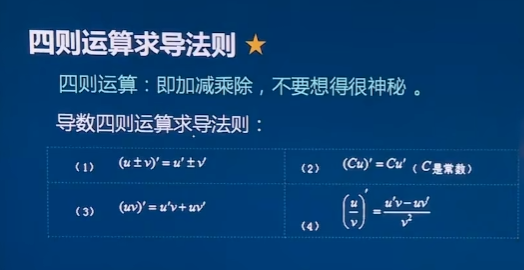
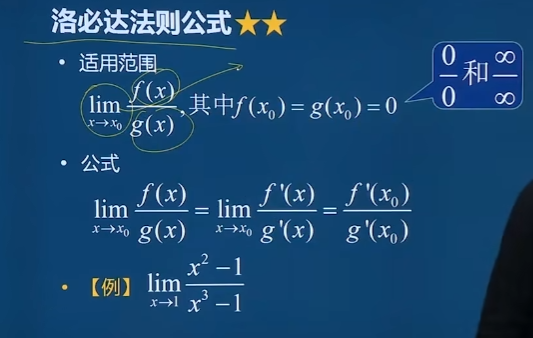
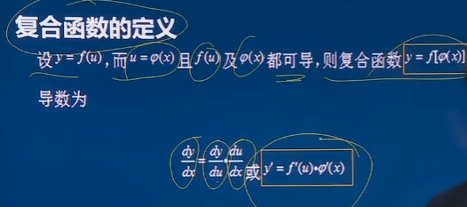
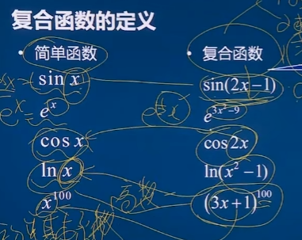

# 导数与微分

求导相当于计算函数在某一点或某一区间上的**瞬时变化率**或**切线斜率**。*f*(*x*)在X上是如何变化的，同时也可以求出函数是否单调。

导数的形式为$\frac{dy}{dx}=y'=f'(x)$

微分：$dy=f'(x)dx$

### 函数求切线某个点的切线或者法线

- (y-y) =f'(X)(X-X)

法线与切线垂直 k法*K切=-1

- (y-y) =-(X-X)/f'(X)

## 偏导数

对于有两个自变量以上的函数求导数。

对谁求偏导就等于 把其他自变量当作常数处理。

x偏导数   $\frac{dz}{dx} =fx'(x,y)$  y偏导数    $\frac{dz}{dx} =fx'(x,y)$

全微分 $dz=\frac{dz}{dx}dx+\frac{dz}{dy}dy$

高阶偏导数

、

## 复合函数求导

