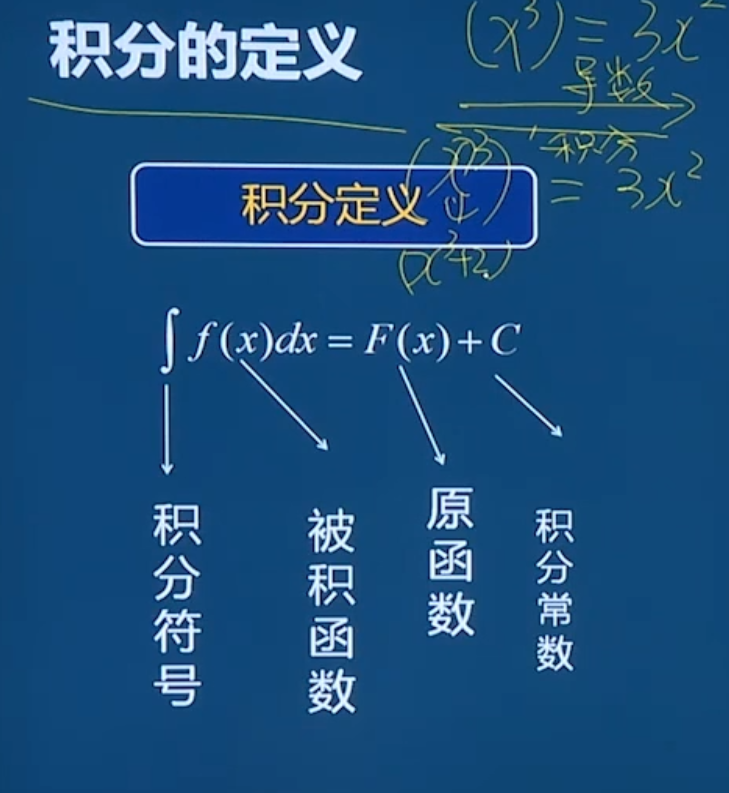
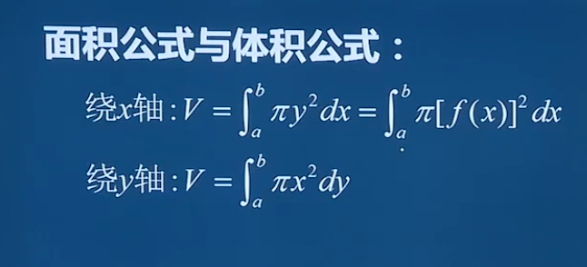

# 积分

### 积分互换公式

$\int_a^b u \mathrm dv = [uv]_a^b - \int_a^b v \mathrm du$

### 积分公式

u和v都是含有x的式子 C是常数

$\int ud(Cv)=C\int udv$

$∫C⋅f(x)dx=C∫f(x)dx$

### 定积分就是就被积函数在 指定范围内的面积 函数与X轴围成的面积

积分求绕轴旋转体积

