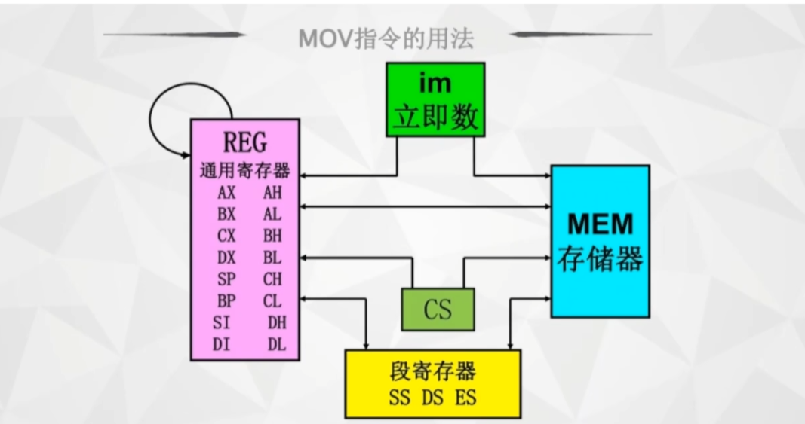

# 第一节 机器语言到汇编语言

## 一、机器语言的局限性

### 1.1 机器语言的特点

- 由二进制代码（0和1）组成
- 计算机可以直接执行
- 执行效率最高

### 1.2 机器语言的缺点

- **难以阅读和理解**：全是0和1，没有语义
- **难以调试**：出错时很难定位问题
- **可移植性差**：不同CPU架构的机器语言完全不同
- **容易出错**：手动编写二进制代码容易出错

## 二、汇编语言的应用场景

### 2.1 适用场景

- 操作系统内核开发
- 嵌入式系统编程
- 性能要求极高的模块
- 设备驱动程序
- 逆向工程和漏洞分析

### 10.2 不适用场景

- 大型应用程序开发
- 快速原型开发
- 跨平台软件开发

## 二、汇编语言的诞生

### 2.1 什么是汇编语言

汇编语言是机器语言的符号化表示，用助记符（Mnemonics）代替二进制操作码。

### 2.2 汇编语言的优势

- **可读性好**：用英文单词或缩写表示指令
- **易于编写**：减少出错概率
- **可调试性强**：便于理解程序逻辑
- **与机器语言一一对应**：效率仍然很高

## 以16位为例说明 8086的总线宽度

### 总线

- 数据总线：用于传输数据
- 地址总线：用于传输地址
- 控制总线：用于传输控制信号

#### 地址总线

- 地址总线为n时 对应寻址空间为2^n
- 用于指定存储单元的地址，决定了寻址空间的大小
- 例如，16位地址总线可以寻址2^16个存储单元（通常一个存储单元为1字节8bit）

#### 数据总线

- CPU与内存或其它器件之间的数据传送是通过数据总线来进行的。
- 数据总线的宽度决定了CPU和外界的数据传送速度。 数据总线宽度决定一次传送的数据量。一个通道为1位，一次即1bit数据。
- 例：向内存中写入数据89D8H时的数据传送
- 注意：1字节（1B） = 8位（8bit）

#### 控制总线

- 控制总线 是一些不同控制信线的集合
- cpu通过 控制总线 对外部设备进行控制
- 控制总线决定了CPU对外部设备的控制能力

#### 数据如何表示

- 0100 1001 1101 1000B 二进制
- 44730O           八进制
- 49D8H           十六进制
- 18904D           十进制

## 三、机器语言与汇编语言的对应关系

### 3.1 操作码的映射


| 机器语言（二进制） | 汇编语言（助记符） | 功能描述 |
| ------------------ | ------------------ | -------- |
| 0000               | NOP                | 空操作   |
| 0001               | MOV                | 数据传送 |
| 0010               | ADD                | 加法     |
| 0011               | SUB                | 减法     |
| 0100               | JMP                | 跳转     |

#### 汇编语言

```assembly
MOV AX, 5    ; 向寄存器AX加载数据5
ADD AX, 3    ; AX寄存器加3
JMP 10       ; 跳转到地址10
```

## 四、汇编语言的基本组成

### 4.1 指令（Instructions）

- 操作码（Opcode）：如 MOV、ADD、SUB
- 操作数（Operands）：寄存器 register、内存地址 [address]、立即数 immediate

### 4.2 伪指令（Directives）

- 指示汇编器如何处理程序
- 不生成机器码
- 示例：ORG、EQU、DB、DW

### 4.3 标号（Labels）

- 表示内存地址
- 便于程序跳转和数据访问
- 示例：START、LOOP、END

#### 物理地址与段地址

- 在 8086 汇编中，“段地址 × 16 + 偏移地址 = 物理地址” CS:IP，其中 CS 是代码段寄存器，IP 是指令指针寄存器。
- 8086 其cpu是16位的，所以地址总线为16位，对应寻址空间为2^16个存储单元，其寄存器宽度为16位（16bit，2字节2B）。
- CS和IP是不可直接访问的，只能通过指令来操作。在编程中不用考虑段地址，只需要考虑偏移地址。
- 编编程中，你几乎感觉不到 CS+IP 的存在，因为汇编器（编译器）帮你把这些脏活累活都干了。

```assembly
    MOV AX, 1
    JMP label    ; 你只关心跳转到 label 这个标签,它计算出 label 标签距离当前指令的偏移地址，修改IP的值。
lab el:
    ADD AX, 2
```

- 在现代计算机中 是32位地址总线或者64位地址总线，对应寻址空间为2^32或2^64个存储单元。其寄存器宽度为32位或64位。
-

##### 单位

- **位（Bit）**：最小的二进制单位，0或1
- **字节（Byte）**：8位，用于存储和处理数据的基本单位
- **字（Word）**：16位，用于存储和处理数据的基本单位（汇编里的 Word = 永远固定 16 位，2字节2B，16bit）
- **机器字长（Machine Word Length）**：指机器一次可以处理的最大数据长度，与计算机位数相同

## 五、汇编过程

### 5.1 汇编器的作用

将汇编语言源程序翻译成机器语言目标程序。

### 5.2 汇编步骤

1. **词法分析**：识别助记符、标号、操作数
2. **语法分析**：检查指令格式
3. **符号表建立**：记录标号地址
4. **代码生成**：将助记符转换为机器码
5. **链接**：组合多个目标文件

## 七、寄存器的使用

### 7.1 通用寄存器 X86下的寄存器

- AX、BX、CX、DX：通用数据寄存器
  - AX：累加器寄存器，用于累加和存储数据
  - BX：基址寄存器，用于存储基址
  - CX：计数寄存器，用于循环计数
  - DX：数据寄存器，用于存储数据
- SI、DI：源变址和目的变址寄存器（存放偏移地址）
- SP、BP：栈指针和基址指针
- CS、IP：代码段寄存器和指令指针寄存器

### 7.2 段寄存器

- CS：代码段寄存器
- DS：数据段寄存器
- ES：附加段寄存器
- SS：栈段寄存器
> 在32位cpu CS、DS、SS 等段寄存器里存放的不再是直接的段基址，但依然是 16 位，而是一个叫“段选择子 (Selector)”的索引值（相当于一个数组下标）
> 64位cpu中，段寄存器被取消了,除了 FS 和 GS 这两个特殊的段寄存器外，其他的段寄存器（CS, DS, ES, SS）的段基址被 CPU 强制设为 0
> 彻底扁平化 线性地址 = 0 + 偏移地址,FS 和 GS 的特殊用途

## 六、常用汇编指令示例

### 6.1 数据传送指令

```assembly
MOV AX, BX      ; 将BX寄存器的值传送到AX
MOV [1000], AX  ; 将AX的值存入内存地址1000
MOV AX, [1000]  ; 从内存地址1000加载数据到AX
```

### 6.2 算术运算指令

```assembly
ADD AX, BX      ; AX = AX + BX
SUB AX, BX      ; AX = AX - BX
MUL AX, BX      ; AX = AX * BX
DIV AX, BX      ; AX = AX / BX
MOD AX, BX      ; AX = AX % BX
INC AX          ; AX加1
DEC AX          ; AX减1
CMP AX, BX      ; （就是减法方式）比较AX和BX的值 将结果存储在标志位中 （ZF、CF、SF、OF）
```

### 6.3 逻辑运算指令

```assembly
AND AX, BX      ; 按位与
OR AX, BX       ; 按位或
XOR AX, BX      ; 按位异或
NOT AX          ; 按位取反
```

### 6.4 控制转移指令

```assembly
JMP START       ; 无条件跳转到START
JZ LOOP         ; 结果为零时跳转
JC NEXT         ; 有进位时跳转
CALL SUBROUTINE ; 调用子程序
RET             ; 从子程序返回
```

## 九、汇编语言程序结构示例

```assembly
; 示例程序：计算1+2+3+...+10
ORG 100h        ; 程序起始地址

MOV CX, 10      ; 循环计数器
MOV AX, 0       ; 累加器

LOOP_START:
ADD AX, CX      ; 累加
DEC CX          ; 计数器减1
JNZ LOOP_START  ; 非零继续循环

MOV [RESULT], AX; 保存结果

HLT             ; 停机

RESULT DW 0     ; 结果存储位置
END
```

##### MOV 指令

- mov target,source ; target表示目标寄存器或内存地址，source表示源寄存器或立即数
- mov reg/mem,imm ; mem表示内存，imm表示立即数（数据）seg表示段寄存器 reg表示寄存器
  - 示例：mov AX, 10H ; 将立即数0010H移动到AX寄存器 （立即数正数自动补0，负数高位全部补1，直到与target数的位数相同）
  - 示例：mov DS, AX ; 将AX寄存器的值移动到DS数据段寄存器
    mov [si], 1010H ; 将1010H的值移动到DS:[SI] 内存单元中  DS是数据段寄存器
- mov reg/mem/seg,reg
- mov reg/seg,mem
- mov reg/mem,seg

> 注意事项:
> 1. target不能是CS（代码段寄存器）
> 2. target和source不能同时为内存数、段寄存器（CS\DS\ES\SS\FS\GS）
> 3. target等于source的长度，才能将数据传送，立即数则是小于等于target的位数即可。
> 4. 不能将立即数传送给段寄存器
> 5 target和source必须类型匹配，比如，要么都是字节，要么都是字或者都是双字等。
> 6. 由于立即数没有明确的类型，所以将立即数传送到target时，系统会自动将立即数零扩展到与target数的位数相同，再进行传送。有时，需要用BYTE PTR、WORD PTR明确指出内存地址的位数


- movzx target,source（不能是立即数） ; target必须大于source的长度  将source的值零扩展到与target数的位数相同，再传送。target必须是字节或字。 其他和mov指令相同。
- movsx target,source（不能是立即数） ; target必须大于source的长度  将source的值高位全补1扩展到与target数的位数相同，再传送。target必须是字节或字。 

##### JMP 指令

- 语法：JMP 目标地址
- 功能：无条件跳转到目标地址 修改的是 IP指令指针寄存器
- 示例：JMP label/address  ; 跳转到标签label

> 需要注意的是，IP 寄存器的位宽会随着 CPU 工作模式的改变而扩展：
> - 在 16 位实模式下：它被称为 IP (Instruction Pointer)，是 16 位的。
> - 在 32 位保护模式下：它被扩展为 EIP (Extended Instruction Pointer)，是 32 位的。
> - 在 64 位长模式下：它被进一步扩展为 RIP (Extended Instruction Pointer)，是 64 位的。
> 无论名称和位宽如何变化，JMP 指令的本质操作始终是修改这个指向“下一条指令”的指针寄存器
