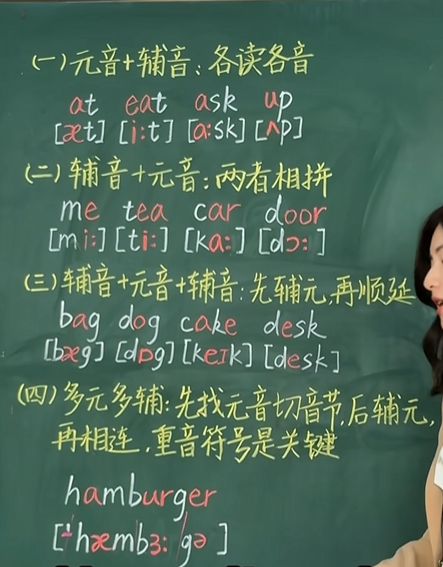

# 英语字母分类指南 (English Alphabet Classification)

英语字母表共有 **26** 个字母，根据发音时气流是否受到阻碍，分为 **元音字母 (Vowels)** 和 **辅音字母 (Consonants)** 两大类。

## 1. 元音字母 (Vowels)

元音字母在发音时，气流通过口腔不受任何阻碍。英语中有 **5** 个基础元音字母，有时也包括半元音性质的 `Y`。

| 字母 | 大写 | 小写 | 备注 |
| :---: | :---: | :---: | :--- |
| A | A | a | 最核心的元音 |
| E | E | e | 最常见的元音 |
| I | I | i | |
| O | O | o | |
| U | U | u | |
| Y | Y | y | **特殊情况**：通常作为辅音（如 *yes*），但在某些词中作为元音（如 *gym*, *happy*）。 |

> **注意**：虽然只有5-6个元音字母，但它们可以组合成多种**元音音素**（如 /i:/, /æ/, /ɔ:/ 等），并构成双元音（如 /ai/, /ou/）。

---

## 2. 辅音字母 (Consonants)

辅音字母在发音时，气流在口腔或咽部受到不同程度的阻碍。除去元音字母，剩下的 **20** 个字母通常被归类为辅音字母。

为了更系统地学习，我们可以根据**发音部位**和**发音方式**对辅音进行细分：

### 2.1 按发音部位分类 (Place of Articulation)

#### A. 双唇音 (Bilabials)
气流受阻于双唇之间。
- **P** (/p/) - 如 *pen*
- **B** (/b/) - 如 *bed*
- **M** (/m/) - 如 *man* (鼻音)

#### B. 唇齿音 (Labiodentals)
气流受阻于上齿和下唇之间。
- **F** (/f/) - 如 *fish*
- **V** (/v/) - 如 *very*

#### C. 齿间音 (Interdentals / Dentals)
舌尖置于上下齿之间。
- **TH** (由字母 **T** 和 **H** 组合表示)
  - 清辅音 /θ/ - 如 *think*
  - 浊辅音 /ð/ - 如 *this*

#### D. 齿龈音 (Alveolars)
舌尖抵住上齿龈。
- **T** (/t/) - 如 *top*
- **D** (/d/) - 如 *dog*
- **S** (/s/) - 如 *sun*
- **Z** (/z/) - 如 *zoo*
- **N** (/n/) - 如 *no* (鼻音)
- **L** (/l/) - 如 *love* (边音)
- **R** (/r/) - 如 *red* (近音/卷舌音)

#### E. 硬腭音 (Palatals)
舌面抬起接近硬腭。
- **SH** (由字母 **S** 和 **H** 组合表示) - /ʃ/ 如 *she*
- **ZH** (通常由 **S** 在特定词中发音，或 **G** 在法语借词中) - /ʒ/ 如 *vision*
- **CH** (由字母 **C** 和 **H** 组合表示) - /tʃ/ 如 *church*
- **J** (/dʒ/) - 如 *jump*
- **Y** (/j/) - 当作辅音时，如 *yes*

#### F. 软腭音 (Velars)
舌后部抬起接触软腭。
- **K** (/k/) - 如 *kite* (也可由 **C** 发出，如 *cat*)
- **G** (/g/) - 如 *go*
- **NG** (由字母 **N** 和 **G** 组合表示) - /ŋ/ 如 *sing* (鼻音)

#### G. 声门音 (Glottals)
气流在声门处受阻。
- **H** (/h/) - 如 *hat*

---

### 2.2 按声带振动分类 (Voicing)

这是学习发音准确度的关键分类：

| 类型 | 描述 | 对应字母示例 (成对出现) |
| :--- | :--- | :--- |
| **清辅音 (Voiceless)** | 发音时声带**不振动**，只送气。 | P, T, K, F, S, TH(θ), SH(ʃ), CH(tʃ), H |
| **浊辅音 (Voiced)** | 发音时声带**振动**，声音低沉。 | B, D, G, V, Z, TH(ð), ZH(ʒ), J(dʒ), R, L, M, N, NG(ŋ), W, Y |

> **记忆技巧**：很多辅音是成对出现的，口型相同，区别仅在于声带是否振动（例如：/p/ 和 /b/，/f/ 和 /v/，/s/ 和 /z/）。

---

### 2.3 其他特殊分类

- **鼻音 (Nasals)**: 气流从鼻腔流出。
  - 字母：**M**, **N**, **Ng** (ng)
- **半元音 (Semi-vowels / Glides)**: 发音介于元音和辅音之间，起连接作用。
  - 字母：**W** (如 *water*), **Y** (如 *yellow*)
- **破擦音 (Affricates)**: 先爆破后摩擦。
  - 组合：**Ch** (/tʃ/), **J** (/dʒ/)

## 总结表

| 类别 | 字母列表 | 数量 |
| :--- | :--- | :---: |
| **元音字母** | A, E, I, O, U (有时含 Y) | 5 (+1) |
| **辅音字母** | B, C, D, F, G, H, J, K, L, M, N, P, Q, R, S, T, V, W, X, Y, Z | 21* |

*\*注：虽然通常说有21个辅音字母，但字母 **Q** 几乎总是与 **U** 连用发 /kw/ 音，字母 **X** 通常发 /ks/ 或 /gz/ 音，它们代表的是辅音组合的发音。*

# 英语拼读规则指南 (English Phonics Rules)

英语拼读（Phonics）是建立字母（Letters）与发音（Sounds）之间联系的学习方法。掌握这些规则能帮助你“见词能读，听音能写”。

> **注意**：英语中有许多例外情况（Sight Words），以下规则覆盖约 70%-80% 的常用单词。

---

## 1. 元音发音规则 (Vowel Rules)

元音字母 (A, E, I, O, U) 主要有两种发音：**短元音 (Short Vowels)** 和 **长元音 (Long Vowels)**。

### 1.1 短元音规则 (CVC 结构)
当元音字母被**辅音**夹在中间（即 **C-V-C** 结构：Consonant-Vowel-Consonant）时，通常发短音。

| 字母 | 短音音标 | 示例单词 | 发音提示 |
| :---: | :---: | :--- | :--- |
| **a** | /æ/ | c**a**t, m**a**p, b**a**g | 嘴巴张大，扁平 |
| **e** | /ɛ/ | b**e**d, p**e**n, r**e**d | 嘴巴微张，嘴角向两边 |
| **i** | /ɪ/ | s**i**t, p**i**g, w**i**n | 短促有力，介于“衣”和“耶”之间 |
| **o** | /ɒ/ 或 /ɑ/ | h**o**t, d**o**g, l**o**t | 嘴巴圆而短促 |
| **u** | /ʌ/ | c**u**p, s**u**n, b**u**s | 短促的“阿”音 |

### 1.2 长元音规则 (Magic 'E' / Silent 'E')
当单词结构为 **元音 + 辅音 + e** (V-C-e) 时，词尾的 `e` 不发音，它会让前面的元音发**字母本音**（即长音）。

| 字母 | 长音音标 | 变化示例 (短 -> 长) |
| :---: | :---: | :--- |
| **a** | /eɪ/ | c**a**t (猫) → c**a**te (无此词，例：m**a**de) |
| **e** | /i:/ | m**e**t (遇见) → m**e**te (分配) |
| **i** | /aɪ/ | k**i**t (工具箱) → k**i**te (风筝) |
| **o** | /oʊ/ | h**o**p (跳) → h**o**pe (希望) |
| **u** | /ju:/ 或 /u:/ | c**u**b (方块) → c**u**be (立方体) |

> **口诀**：*Silent E makes the vowel say its name.* (不发音的 E 让元音念自己的名字)

### 1.3 元音组合 (Vowel Teams)
当两个元音字母在一起时，通常遵循 **"When two vowels go walking, the first one does the talking"** (两个元音一起走，第一个开口唱) 的规则，即第一个发长音，第二个不发音。

| 组合 | 发音 | 示例单词 | 例外提示 |
| :--- | :--- | :--- | :--- |
| **ai** | /eɪ/ | r**ai**n, p**ai**nt, tr**ai**n | |
| **ay** | /eɪ/ | d**ay**, pl**ay**, s**ay** | 通常出现在词尾 |
| **ee** | /i:/ | s**ee**, f**ee**t, tr**ee** | |
| **ea** | /i:/ 或 /ɛ/ | t**ea** (长), br**ea**d (短) | *bread, head* 是常见例外 |
| **oa** | /oʊ/ | b**oa**t, c**oa**t, g**oa**l | |
| **oe** | /oʊ/ | t**oe**, h**oe** | 通常在词尾 |
| **ui** | /u:/ 或 /ɪ/ | fr**ui**t, j**ui**ce / b**ui**ld | 变化较多 |
| **ie** | /i:/ 或 /aɪ/ | f**ie**ld / p**ie** | *i before e except after c* |

---

## 2. 辅音及组合规则 (Consonant & Blend Rules)

### 2.1 硬音与软音 (Hard & Soft Sounds)
字母 **C** 和 **G** 的发音取决于后面的元音。

| 字母 | 规则 | 发音 | 示例 (硬) | 示例 (软) |
| :--- | :--- | :---: | :--- | :--- |
| **C** | 后接 **a, o, u** | /k/ (硬) | **c**at, **c**ot, **c**ut | |
| | 后接 **e, i, y** | /s/ (软) | | **c**ell, **c**ity, **c**ycle |
| **G** | 后接 **a, o, u** | /g/ (硬) | **g**o, **g**ame, **g**un | |
| | 后接 **e, i, y** | /dʒ/ (软) | | **g**em, **g**iant, **g**ym |
| | *例外* | /g/ | **g**et, **g**ift, **g**ive | (这三个词虽接e/i但仍发硬音) |

### 2.2 常见的辅音组合 (Digraphs)
两个字母组合发出一个全新的声音。

| 组合 | 发音 | 示例单词 | 备注 |
| :--- | :---: | :--- | :--- |
| **sh** | /ʃ/ | **sh**ip, fi**sh**, wa**sh** | 嘘声 |
| **ch** | /tʃ/ | **ch**air, lun**ch**, mu**ch** | 吃声 |
| **th** | /θ/ (清) | **th**ink, **th**umb | 咬舌，无声带振动 |
| | /ð/ (浊) | **th**is, mo**th**er | 咬舌，声带振动 |
| **wh** | /w/ 或 /h/ | **wh**at, **wh**ale | 在 *who, whose* 中发 /h/ |
| **ph** | /f/ | **ph**one, gra**ph**ic | 源自希腊语 |
| **ck** | /k/ | du**ck**, ba**ck**, lo**ck** | 通常跟在短元音后 |
| **ng** | /ŋ/ | si**ng**, lo**ng**, ri**ng** | 鼻音，通常在词尾 |
| **qu** | /kw/ | **qu**een, **qu**ick | Q 几乎总跟着 u |

### 2.3 辅音连缀 (Blends)
两个或多个辅音连在一起，每个音都要读出来，只是读得很快。

- **L-Blends**: bl (blue), cl (clock), fl (fly), gl (glad), pl (play), sl (sleep)
- **R-Blends**: br (bread), cr (crow), dr (dress), fr (frog), gr (green), pr (press), tr (tree)
- **S-Blends**: sc, sk, sl, sm, sn, sp, st, sw (如: *stop, swim, star*)
- **T-Blends**: tw (two), thr (three)

---

## 3. 特殊音节与重音规则

### 3.1 R 控制元音 (R-Controlled Vowels)
当元音后面跟着字母 **r** 时，元音的发音会改变，不再发标准的长音或短音。

| 组合 | 发音近似 | 示例单词 |
| :--- | :--- | :--- |
| **ar** | /ɑːr/ | c**ar**, st**ar**, f**ar** |
| **or** | /ɔːr/ | f**or**, h**or**se, sh**or**t |
| **er, ir, ur** | /ɜːr/ | t**er**m, b**ir**d, n**ur**se | (这三个组合发音通常相同) |
| **are** | /ɛər/ | c**are**, sh**are** |
| **ore** | /ɔːr/ | m**ore**, sc**ore** |

### 3.2 双写规则 (Doubling Rule)
当动词或形容词以 **短元音 + 单个辅音** 结尾，且需要加后缀（如 -ing, -ed, -er）时，通常需要**双写**末尾的辅音。

- **Run** → Ru**nn**ing (短音 /ʌ/ 保持)
- **Big** → Bi**gg**er
- **Stop** → Sto**pp**ed
- *对比*：**Hope** → Hoping (因为有 Magic E，元音是长的，不双写)
- *对比*：**Look** → Looking (元音是组合音/长的，不双写)

### 3.3 Y 的变音规则
字母 **Y** 在词尾时的发音规则：
1. **单音节词尾**：发长音 **/aɪ/** (like 'I')。
   - 例：cr**y**, fl**y**, m**y**, sk**y**。
2. **多音节词尾**：发长音 **/i/** (like 'E')。
   - 例：bab**y**, happ**y**, sunn**y**, cand**y**。
3. **词首**：作为辅音 **/j/**。
   - 例：**y**es, **y**ellow。

---

## 4. 学习建议

1. **自然拼读不是万能药**：英语中有约 20%-30% 的单词不符合规则（称为 **Sight Words** 或 **Heart Words**），如 *the, said, come, one*，这些需要整体记忆。
2. **多听多读**：规则是辅助，大量的听力输入和阅读实践才能形成语感。
3. **注意重音**：多音节单词中，重音位置不同，元音的发音可能会发生变化（如弱读成 /ə/）。
   - 例：**PHO**-to (照片) vs. pho-**TOG**-ra-phy (摄影)。