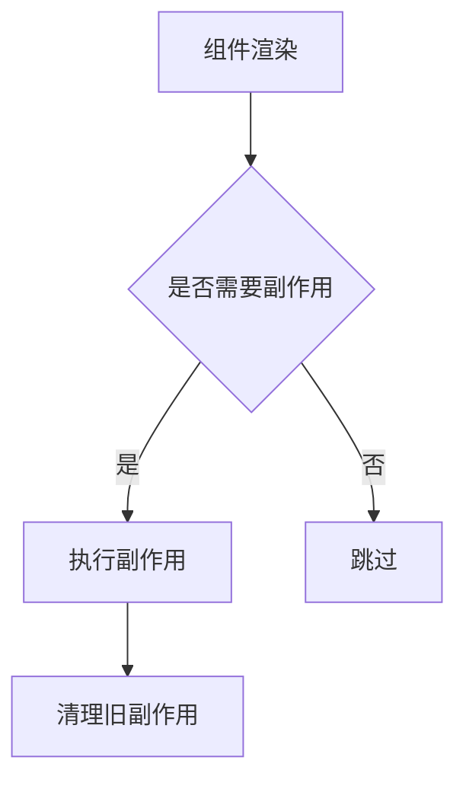
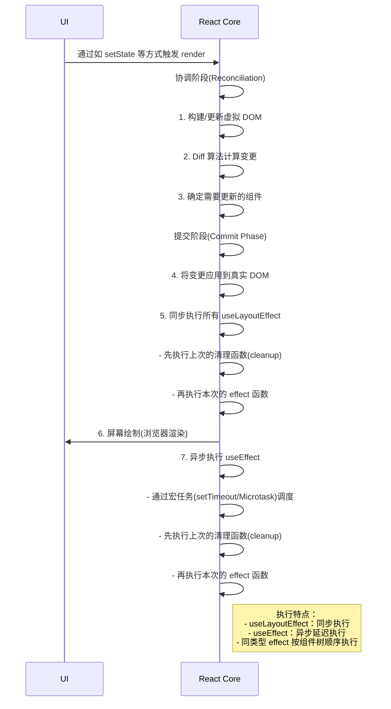

# 神奇的副作用（useEffect）


## 一、核心概念与设计思想

### 1.1 什么是副作用？
在 React 中，**副作用**指组件渲染过程中发生的与 UI 无关的操作：
- 数据获取（API 调用）
- 订阅/事件监听
- 手动修改 DOM
- 记录日志
- ⚠`注意：react中的副作用"仅用于UI—>驱动外部时使用", `

### 1.2 useEffect 的设计目标


解决 Class 组件中生命周期方法混杂的问题，统一处理：
- `componentDidMount`
- `componentDidUpdate`
- `componentWillUnmount`


## 二、源码执行流程（React 18）

### 2.1 数据结构定义
```javascript
// packages/react-reconciler/src/ReactFiberHooks.js
type Effect = {
tag: HookFlags, // 标记位（是否首次渲染/依赖变化）
create: () => (() => void) | void, // 副作用函数
destroy: (() => void) | null, // 清理函数
deps: Array &lt;mixed> | null, // 依赖数组
next: Effect, // 链表指针
};
```
### 2.2 挂载阶段（Mount）
```javascript
function mountEffectImpl(fiberFlags, hookFlags, create, deps) {
const hook = mountWorkInProgressHook();
// 创建 effect 对象
hook.memoizedState = pushEffect(
HasEffect | hookFlags,
create,
undefined,
deps
);
// 标记 fiber 需要执行 effect
scheduleWorkOnFiber(fiber, fiberFlags);
}
```
### 2.3 更新阶段（Update）
```javascript
function updateEffectImpl(fiberFlags, hookFlags, create, deps) {
const hook = updateWorkInProgressHook();
const prevEffect = hook.memoizedState;
if (areHookInputsEqual(deps, prevEffect.deps)) {
// 依赖未变化 → 跳过执行
pushEffect(hookFlags, create, prevEffect.destroy, deps);
return;
}
// 依赖变化 → 执行新 effect
hook.memoizedState = pushEffect(
HasEffect | hookFlags,
create,
prevEffect.destroy,
deps
);
scheduleWorkOnFiber(fiber, fiberFlags);
}
```
### 2.4 执行机制（Commit 阶段）
```javascript
// packages/react-reconciler/src/ReactFiberCommitWork.js
function commitHookEffectList(phase, finishedWork) {
const firstEffect = finishedWork.updateQueue;
let effect = firstEffect;
do {
if ((effect.tag & phase) === phase) {
// 执行清理函数
if (phase === Passive && effect.destroy) {
effect.destroy();
}
// 执行副作用函数
if (phase === PassiveUnmount) {
const create = effect.create;
effect.destroy = create();
}
}
effect = effect.next;
} while (effect !== firstEffect);
}
```

## 三、关键特性实现原理

### 3.1 依赖比较算法
```javascript
function areHookInputsEqual(nextDeps, prevDeps) {
if (prevDeps === null) return false;
if (nextDeps === null) return false;
for (let i = 0; i < prevDeps.length; i++) {
if (!Object.is(nextDeps[i], prevDeps[i])) {
return false;
}
}
return true;
}
```
- 使用 `Object.is` 进行精确比较
- 空依赖数组 `[]` 表示只执行一次
- `undefined` 表示每次渲染都执行

### 3.2 清理机制
```javascript
// 自动生成清理函数
const effect = () => {
const subscription = subscribe(data);
return () => subscription.unsubscribe(); // 返回清理函数
}
// 执行时机：
// 1. 组件卸载时
// 2. 下次 effect 执行前
// 3. 依赖变化导致重新执行时
```
### 3.3 异步调度优化
```javascript
// 使用 requestIdleCallback 或 microtask
const schedulePassiveEffects = () => {
if (rootWithPendingPassiveEffects !== null) {
// 批量处理所有 passive effects
flushPassiveEffects();
}
};
```
- 在浏览器空闲期执行
- 避免阻塞主线程渲染


## 四、执行顺序与规则

### 4.1 多 effect 执行顺序

### 4.2 与 useLayoutEffect 区别
| 特性                | useEffect       | useLayoutEffect |
|---------------------|-----------------|-----------------|
| 执行时机            | 浏览器绘制后    | DOM 变更后      |
| 阻塞性              | 非阻塞          | 阻塞渲染        |
| 适用场景            | 数据获取/订阅   | DOM 测量/修改   |


## 五、最佳实践与陷阱规避

### 5.1 正确依赖声明
```jsx
// ❌ 错误：遗漏依赖
useEffect(() => {
setCount(count + 1);
}, []); // count 来自闭包，不会更新
// ✅ 正确：添加依赖或使用函数式更新
useEffect(() => {
const timer = setInterval(() => {
setCount(c => c + 1); // 安全更新
}, 1000);
return () => clearInterval(timer);
}, []);
```
### 5.2 避免无限循环
```jsx
// ❌ 错误：直接修改状态导致循环
const [data, setData] = useState(null);
useEffect(() => {
setData(fetchData()); // 触发重新渲染
}, [data]); // 依赖 data 导致循环
// ✅ 正确：使用条件判断
useEffect(() => {
if (!data) {
setData(fetchData());
}
}, [data]);
```
### 5.3 清理函数的重要性
```jsx
// 避免内存泄漏
useEffect(() => {
const socket = new WebSocket(url);
socket.onmessage = handleMessage;
return () => { // 必须清理！
socket.close();
};
}, [url]);
```

## 六、高级模式

### 6.1 自定义 Hook 封装
```javascript
function useWindowSize() {
const [size, setSize] = useState({ width: 0, height: 0 });
useEffect(() => {
const handleResize = () => {
setSize({ width: window.innerWidth, height: window.innerHeight });
};
handleResize();
window.addEventListener('resize', handleResize);

return () => window.removeEventListener('resize', handleResize);
}, []);
return size;
}
```
### 6.2 并发/异步模式下的安全
```javascript
// 使用 ref 保存最新值
const isActiveRef = useRef(true);
useEffect(() => {
isActiveRef.current = true;
fetchData().then(data => {
if (isActiveRef.current) { // 检查组件是否仍挂载
setData(data);
}
});
return () => {
isActiveRef.current = false;
};
}, []);
```

## 七、总结

**useEffect 本质**：
- React 的**异步副作用调度器**
- 通过**链表+依赖比较**管理执行逻辑
- 在**commit 阶段后**异步执行

**设计哲学**：
> "将组件的行为与渲染分离，让 React 成为纯函数"

**性能关键**：
- 依赖数组的精确控制
- 及时清理资源
- 避免在 effect 中执行高开销操作

通过深入理解 useEffect 的源码实现，开发者可以更精准地控制副作用，构建高性能的 React 应用。