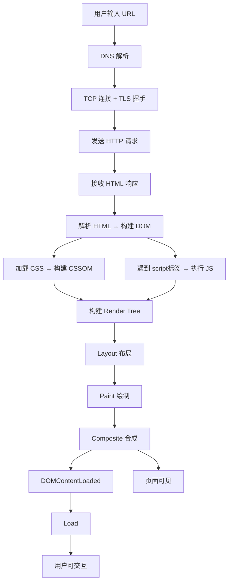

# 从用户输入到浏览器渲染 mermaid

```mermaid
graph TD
    A[用户输入 URL] --> B[DNS 解析]
    B --> C[TCP 连接 + TLS 握手]
    C --> D[发送 HTTP 请求]
    D --> E[接收 HTML 响应]
    E --> F[解析 HTML → 构建 DOM]
    F --> G[加载 CSS → 构建 CSSOM]
    F --> H[遇到 script标签 → 执行 JS]
    G & H --> I[构建 Render Tree]
    I --> J[Layout 布局]
    J --> K[Paint 绘制]
    K --> L[Composite 合成]
    L --> M[DOMContentLoaded]
    L --> N[页面可见]
    M --> O[Load]
    O --> P[用户可交互]
```

